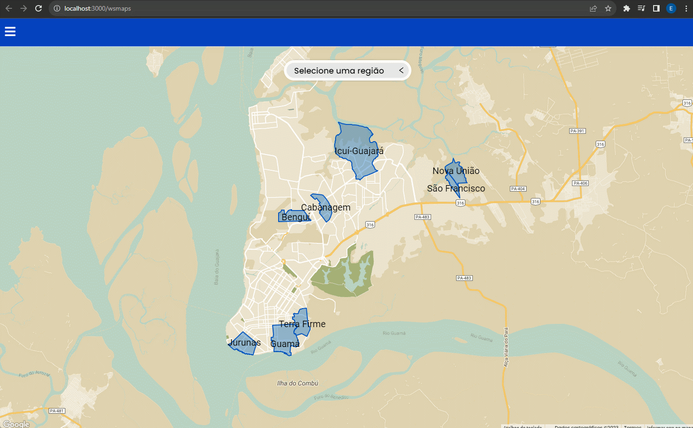

<h1>
    
    
 Web Social Maps

</h1>

# Sobre 
O WSMaps é uma plataforma que busca exibir informações de deversos bairros paraenses, foco de estuddo do <a href="https://www.biblio.campusananindeua.ufpa.br/index.php/conteudo-do-menu-superior/797-mapas-digitais">Projeto Mapas Digitais</a>, que com a ajuda dos moradores locais coletou dados de 7 regiões,  referente a diversas estátisticas relacionadas à urbanização, comércio e eduacação, esses dados foram condençados em uma API que foi utilizada neste projeto.

# Ferramentas 
A interface conta com as ferramentas de. Temas para selecionar locais de enteresse, Buscas para buscar em uma determinada região uma lista de locais com combinem com a palavra chave, Ruas para selecionar quais informações refente ao estado das vias mostrar na região e Legendas para mostra quais informações estão sendo exibidas.

<!--  -->

*Página Inicial do Projeto WSMaps*

*Legendas da Região*

*Telas das Ferramentas*

# Tecnologias
Este projeto foi objeto de pesquisa do meu TCC na conclusão do curso de engenharia da computação, com o tema: "Considerações de Design para Visualização de Dados Sociais em Mapas Web". E para a publicação de um artigo no CLIHC23 como o título de "Design Considerations for Visualizing Social Data in Web Maps" onde é abordado diversass considerações de design e usabilidade para este tipo de aplicação. Neste projeto foram utilizadas as seguintes tecnologias.

    - React.js
    - GoogleMapsAPI.js
    - Google Cloud
    - Axios
    - CSS3

# Mais
Se você curtiu a ideia ou quer dar uma olhada no projeto, ele está online no github pages e você pode acessa-lo clicando <a href="https://imfernandes23.github.io/wsmaps/">AQUI</a>.

